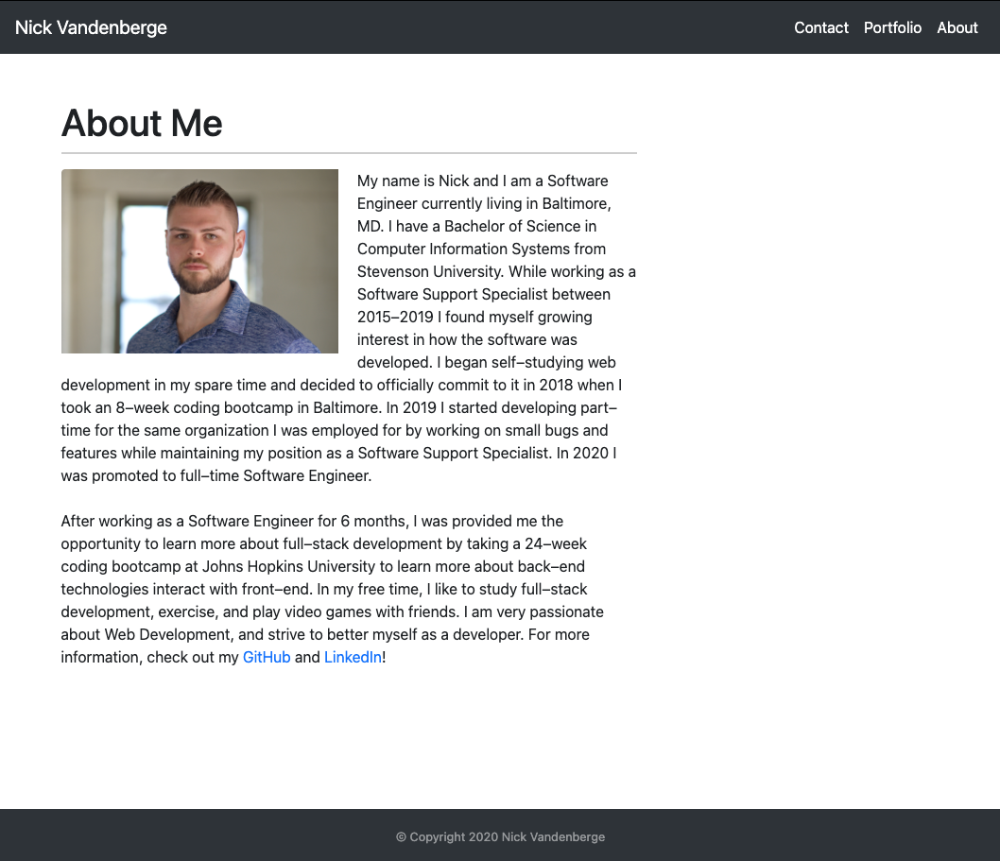
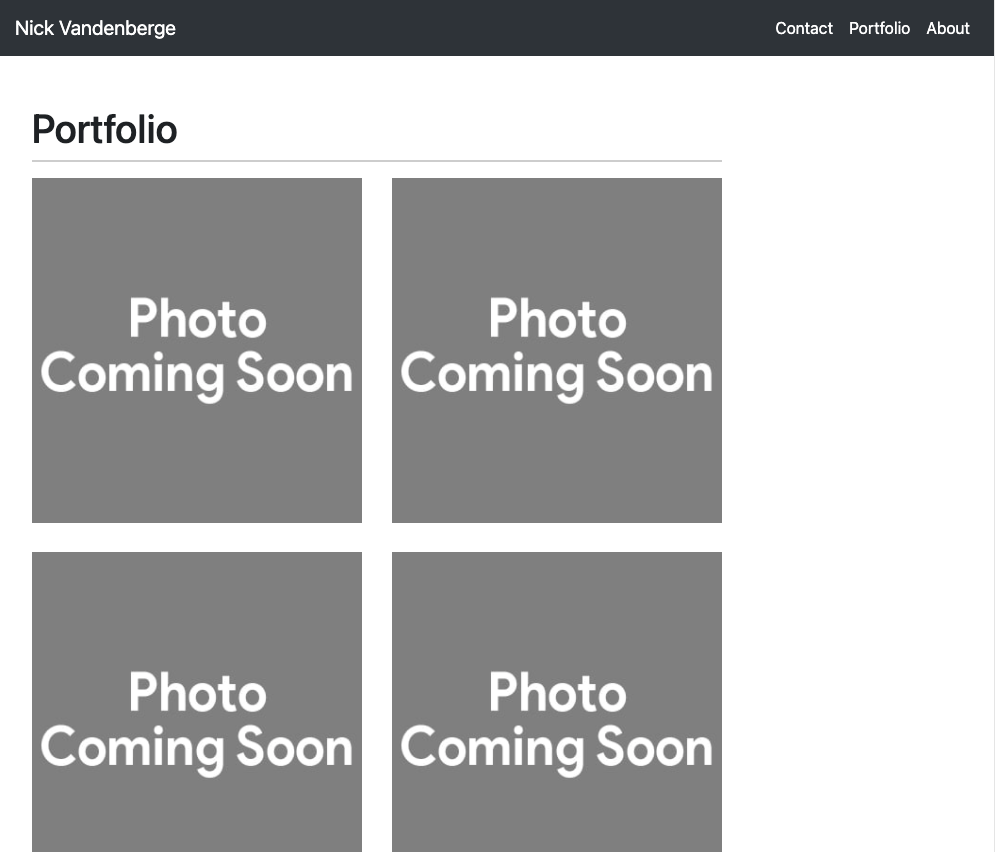
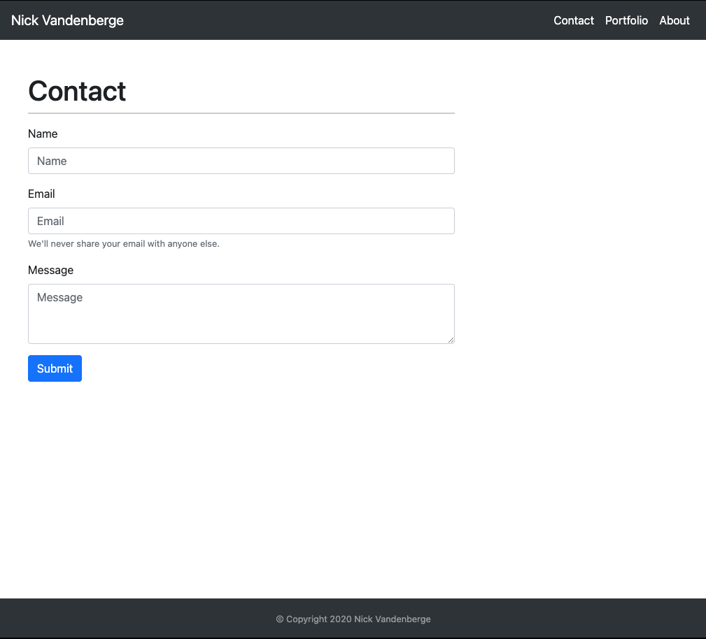

# Homework02-ResponsivePortfolio
This is my first portfolio website that contains some information about me, a list of my development projects, and provides a way to contact me. This website is responsive and mobile ready!

## Purpose
Get to know me and my background as a developer. Users may also use the links in the top navbar to view my portfolio projects as well as contact me. 

## Usage
### About Me

### Portfolio

### Contact

## Technolgies
- Visual Studio Code
- Git
- HTML5
- CSS
- Bootstrap v4.5.3

## Goals
- Create and link 3 seperate webpages.
- Use Bootstrap.
- Use semantic HTML for accessiblity.
- Webpages are responsive and work on all devices.
- Use a grid layout to add content.

## Planned Enhancemnets:
- &#9744; Update Portfolio page with personal projects.
- &#9744; Update all pages with small transitions and animations to add fluidness.
- &#9744; Add ability to collect contact information when submitted on contact page.
- &#9744; Update color scheme and styling.
